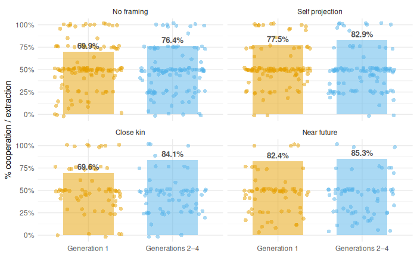

<!-- _footer: "" -->

# Intragenerational Conflict and the Framing of the Future  
## *Experimental Evidence on Intergenerational Cooperation*

### Dimitri Dubois 

📧 dimitri.dubois@umontpellier.fr

*CEE-M, Univ. Montpellier, CNRS, INRAE, Institut Agro.*

---

## Context

Two public events:

- *Nuits des chercheurs* (October 2024, Montpellier).

- *Fête de la Science* (October 2024, Montpellier).

Scientists usually present posters and interactive demonstrations to foster discussions with visitors.

---

We decided to turn these events into a field lab, by collecting experimental data from the general public.

- Behavioral and experimental economics often rely on student samples.
- These events offer a unique opportunity to reach a more diverse population (age, profession, family structure).

---

- The 2024 Fête de la Science in Montpellier was organized under the theme **“Océan de savoir”** (*Ocean of Knowledge*).
- This theme inspired us to design an experiment about **resource sharing and sustainability**.  
- During these events, visitors come to the stand *one group after another* — families, friends, children, grandparents — which naturally mirrors **a sequence of generations** exploiting a shared resource.  

 

> ⇒ **We decided to focus on intergenerational common pool resources**.

---

## The Common-Pool Resource (CPR) Problem

- A common-pool resource (CPR) is a resource that is:
  - **rivalrous** (one’s use reduces what remains)  
  - **non-excludable** (others can access it).

Examples: fisheries, groundwater, forests …

 

>*Individually rational extraction leads to collective collapse.*   
⇒ known as **the tragedy of the commons** (Hardin, 1968).  

---

### The CPR Game 

*Walker, Herr, Gardner & Ostrom (2000)*

- $n$ players share a common resource.
- Each player $i$ chooses an extraction level $x_i$.
- Total extraction: $X = \sum_{j=1}^n x_j$
- Individual Payoff: $\pi_i(x_i, X) = a x_i - b x_i^2 - x_i(c + k X)$

Where:
- $B_i(x_i) = a x_i - b x_i^2$ : Individual benefit function (increasing, concave)
- $C_i(x_i, X) = x_i (c + kX)$ : Individual cost function (increasing, convex, with negative externality from total extraction)

---

**Nash equilibrium**: Each player maximizes their own payoff given the others’ decisions: $\max_{x_i} \ \pi_i(x_i, X_{-i}) = a x_i - b x_i^2 - x_i (c + kX)$
Assuming symmetry $x_i = x$, $X = nx$ ⇒ $x_i^{N} = \frac{a - c}{2b + k(n+1)}$

**Social optimum**: Maximize total group payoff $\Pi = \sum_{i=1}^n \pi_i$
$\max_{x_1, \dots, x_n} \ \sum_{i=1}^{n} \left(a x_i - b x_i^2 - x_i (c + kX)\right)$ ⇒ $x_i^{SO} = \frac{a - c}{2b + 2kn}$

 

---

### Beyond the Tragedy: Institutions and Collective Action

- **E. Ostrom** (1990, *Governing the Commons*) showed that collapse is not inevitable.
- Field and lab evidence that many communities often create institutions, norms, and rules to manage CPRs sustainably (Ostrom, Walker & Gardner, 1992; Walker et al., 2000).
  - Key mechanisms:
    - Communication and shared norms  
    - Monitoring and graduated sanctions  
    - Collective choice (voting, self-governance)

---

### From Intragenerational to Intergenerational CPRs

- Almost all naturally occurring CPRs are **intergenerational**: climate change, biodiversity loss, and resource depletion depend on today’s choices.
- Mechanisms that have been shown to mitigate the overexploitation problem are not easily available across distant generations of users: future generations have **no agency** — they cannot reciprocate, vote, or punish. 

⇒ **Cooperating with the future** is a special kind of social dilemma.  

 

> In most CPR studies and experiments, players belong to the same generation and interact simultaneously.  
*What happens when **different generations** exploit the same resource over time?*

---

### Intergenerational CPR - Literature Review

---

### The Intergenerational Goods Game (IGG)

*Hauser, Rand, Peysakhovich, Nowak (2014, Nature)*

- Successive generations of 5 players share a common pool of 100 units.
- Each player can extract 0–20 units.
- If total extraction ≤ threshold T = 50%, the pool renews to 100 units.  
- If extraction > T, the resource collapses → all future generations get 0.
- The game continues with probability $δ = 0.8$ (≈ 5 generations expected).

 

> **Social optimum:** 10 units per player  
> **Individual temptation:** 20 units

---

--- 

### Hauser et al.'s results

- When individuals decide independently, the pool is almost always exhausted.  
A minority of over-extractors destroys sustainability.

- When decisions are made democratically (median voting), the pool is sustained across generations.
 
 

⇒ Voting allows:
- the pro-social majority to overrule selfish players;
- conditional cooperators to trust others’ intentions.

 

> ⇒ Institutions matter — democracy can help cooperate with the future.

---

## Intragenerational conflict undermines cooperation with the future

*Bayle, G., Pinçon, V., Barragan-Jason, G., Bazart, C., Ibanez, L., Roussel, S., Syssau-Vaccarella, A., Dubois, D., Willinger, M.*

--- 

### Research Question

***Does intragenerational conflict undermine cooperation with the future?***

We disentangle:
- Intergenerational dilemma: present vs. future.  
- Intragenerational dilemma: conflict among current individuals.

---

### Adapted IGG

- Two treatments:
  - **1P**: one player extracts 0–60 units (intergenerational dilemma only).
  - **3P**: three players extract 0–20 units each (inter + intragenerational dilemmas).
- Renewal threshold T = 30 units (≤ 50 % of the resource).
- If extraction > T → resource collapses → all future payoffs = 0.
- No probabilistic continuation (5 generations fixed).

---

---

### Hypotheses

1. **H1:** Cooperation is higher when no intragenerational conflict exists (1P > 3P).  
2. **H2:** Intragenerational conflict reduces sustainability via coordination failures.

---

### Data collection

- During the 2024 *Nuits des chercheurs* and the 2024 *Fête de la Science*
- Participants were students and general public.
- Experiment implemented on tablets.
- 5 generations (not $\delta$-probabilistic).
- No interaction between participants, they arrived sequentially → strategy method : participants took decisions for generation 1, generations 2–4, and generation 5 (no future value).
- Generations constituted ex post, after data collection.
- Participants were paid according to their extraction decisions, by bank transfer (€ 0.15/unit in 1P and € 0.45/unit in 3P).
- 260 participants (137 in *1P* and 123 in *3P*).

---

### Results

⇒ With contemporaries, cooperation collapses (*fisher test p<0.001*).

---

#### Extraction Distributions

Distributions are significantly different between the two treatments  
*ks-test, p < 0.001*

---

|                            | Cooperation | Extraction (%) |
|----------------------------|-------------|----------------|
| 1P × Gen 1 (réf.)          | 12.702***   | 0.406***       |
| 3P vs 1P                   | -4.566*     | 0.126***       |
| Gen 2–4 vs Gen 1           | -1.840      | -0.027+        |
| Interaction (3P × Gen 2–4) | 4.688*      | -0.027         |
|                            |             |                |
| Num.Obs.                   | 520         | 520            |

*Note*: $^+$ p < 0.1, $^{*}$ p < 0.05, $^{**}$ p < 0.01, $^{***}$ p < 0.001

---

#### Resource sustainability

*Monte Carlo (10 000 trajectories)* to estimate the **expected survival of the resource** over five generations.

---

1. Draw participants from the experiment (4 in 1P, 12 in 3P, w/o replacement).
2. Form 4 generations (1 or 3 players per generation).
3. Apply the renewal rule: 
    - Resource renews if total extraction in the generation ≤ 30 units.
    - If extraction > 30 → resource collapses.
4. Store the generation at which the resource collapses (if any), otherwise store 5 (full survival).
5. Repeat the process 10,000 times to simulate variability in group composition and decisions.
6. Compute, for each generation, the fraction of trajectories in which the resource is depleted, and the expected survival duration of the resource.

---

**⇒  Intragenerational conflict drastically reduces resource sustainability**.

---

### Ex-post theoretical models

- The first model assumes fully rational agents with perfect foresight and common knowledge — they know the game and reason infinitely forward.

- The second model assumes boundedly rational agents — they maximize utility, but their beliefs are simplified and shaped by heuristics rather than full strategic reasoning.

---

#### 1. Rational Intergenerational Goods Game (IGG)
- Let $u_g=x_g$ : utility of generation $g$ equals its extraction.  
- Let $V_g$ the total utility of generation $g$: 
$$V_g = u_g + \beta V_{g+1}$$

  

$\beta$ captures the intergenerational altruism.
<small>
- $\beta \in [0,1)$: future generations weighted less than the present (present = 1).
- $\beta$ constant across generations — current altruism projected forward.
</small>

---
$
\begin{align*}
V_1 &= u_1 + \beta V_2 = u_1 + \beta (u_2 + \beta V_3) \\
    &= u_1 + \beta u_2 + \beta^2 (u_3 + \beta V_4) = \cdots = u_1 + \beta u_2 + \beta^2 u_3 + \cdots \\
    &= u \cdot \frac{1}{1 - \beta} \quad \text{if } u_g = u, \forall g \text{ and } n \to \infty
\end{align*}
$

 

⇒ cooperation if $V_1 > 60$ ⇒ $30 \times \frac{1}{1 - \beta} > 60$ ⇒ $\beta > 0.5$.

 

**n=1 — 1P**  

- If $\beta > 0.5$, the extraction path is sustainable and optimal. 
- If $\beta \leq 0.5$, the extraction path is non-sustainable.

---

**n=3 — 3P**

Introduce $\hat{x}_{g}^{-i}$ which is player $i$'s belief about the total extraction  of the two other players in his generation.

⇒ $V^i_g=u^i_g(x^i_g, \hat{x}_{g}^{-i}) + \beta V_{g+1}$

 

3 possible cases:
1. The two other players have $\beta \leq 0.5$.
2. The two other players have $\beta > 0.5$.
3. One player has $\beta \leq 0.5$ and the other $\beta > 0.5$.

---

***Myopic players***: *they assume that the composition of their current generation will not change in future generations.*

- if $\beta_i \leq 0.5$, player $i$ extracts 20 units, whatever their beliefs about others.
- if $\beta_i > 0.5$, player $i$'s extraction depends on their beliefs about others' altruism.
  - Case 1 (others' $\beta \leq 0.5$): $\hat x^{-i}_g=40$ ⇒ $x^i_g=20$.
  - Case 2 (others' $\beta > 0.5$): $\hat x^{-i}_g=20$ ⇒ $x^i_g=10$.
  - Case 3 (mixed): the player with $\beta \leq 0.5$ extracts 20, leading $i$ to believe $\hat x^{-i}_g \geq 20$ ⇒ both players with $\beta > 0.5$ have to coordinate to reach $x_{g}^{i} + x_{g}^{k} = 10$, but coordination failure may occur ($x_{g}^{i} + x_{g}^{k} > 10$).

---

**Farsighted player**: *they anticipate that the composition of their current generation may change in future generations.*

Let $p$ be the probability that the next generation will not deplete the resource.

$$
V_{1}^{i} = u_{1}^{i}(x_{1}^{i}, x_{1}^{-i}) + \beta E[V_{2}], \quad \text{where} \quad
E[V_{2}] = p V_{2}^{\text{sust}} + (1 - p) \times 0 = p V_{2}^{\text{sust}}
$$

 

$$\begin{align*}
V_{1} &= u_{1} + \beta p \left[ u_{2} + \beta V_{3} \right] \\
     &= u_{1} + \beta p \left[ u_{2} + \beta p \left[ u_{3} + \beta V_{4} \right] \right] \\
     &= u_{1} + \beta p u_{2} + \beta^2 p^2 u_{3} + \cdots \\
     &= u \times \left( \frac{1}{1 - \beta p} \right) \quad \text{if } u_g = u, \forall g \text{ and } n \to \infty
\end{align*}
$$
---

Cooperation if $\frac{30}{1 - \beta p} > 60$ ⇒ $\beta p > 0.5$

With farsightedness, as the probability of sustainability decreases, the altruistic component must increase to compensate.

---

#### 2. Boundedly Rational Intergenerational Goods Game (IGG)

$$
u_{i,g} =
\begin{cases}
x_{i,g} + \beta_{i,g} \cdot p_{i,g} \cdot V_{g+1}, & \text{if } X_g \leq 30 \\
x_{i,g}, & \text{if } X_g > 30
\end{cases}
$$

where:

- $\beta_i \in [0,1]$ is the player's altruism parameter,

- $p_{i} \in [0,1]$ is the player's belief that the other players will cooperate with the future and that the resource will survive to the next generation.

- $V_{g+1} = 30 + \beta_{i,g} \cdot p_{i,g} \cdot V_{g+2}$ ⇒ $V_{g+1} = \frac{30}{1 - \beta_{i,g} p_{i,g}}$
<small>assuming $X_{g+m} = 30$ $\forall m \geq 1$ and infinite horizon.</small>

---

⇒ $u_{i,g} = x_{i,g} + \beta_{i,g} \cdot p_{i,g} \cdot \frac{30}{1 - \beta_{i,g} p_{i,g}}$

- $\beta_{i,g} \cdot p_{i,g}$ captures the interaction between player $i$'s altruistic preferences and their beliefs about others' cooperativeness. 
- We refer to it as ***effective altruism***, as it captures the idea that beliefs moderate the expression of altruistic preferences.

---

**n=1 — 1P**

- $p_{i, g}=1$, beliefs about others' cooperation are irrelevant.

$$
u_{i,g} =
\begin{cases}
30 + \beta_{i,g} \cdot \frac{30}{1 - \beta_{i,g}} = 30 \cdot \frac{1}{1 - \beta_{i,g}} & \text{if cooperation}  \\
60 & \text{if defection} 
\end{cases}
$$

⇒ cooperation if $\beta_{i,g} \geq 0.5$.

 

> In the absence of perceived intragenerational competition, cooperation depends only on a player's personal valuation of future welfare.

---

**n=3 — 3P**

- Players must form beliefs about others’ behaviors.
- Cooperation is contingent on altruism and expectations.

Let the belief parameter $p_{i,g}$ be a function of the perceived distance from the sustainability threshold $z=30-\mathbb{E}[X_{-i, g}]$

where $\mathbb{E}[X_{-i, g}] \in \{0, 40\}$ is player $i$'s expectation of the total extraction by the other two players in generation $g$. 

$z$ is referred to as the ***perceived sustainability***. 

><small>A higher $z$ means player $i$ believes others will extract less. If player $i$ has altruistic concerns for the future, $z$ represents the maximum amount they believe they can extract without depleting the resource.</small>

---

Let $p_{i,g} = \phi(z, \alpha)$ such that:
$$\phi(z, \alpha) =
\begin{cases}
1, & \text{if } z \geq 30 \\
f(z, \alpha), & \text{if } 0 < z < 30, \text { with } \alpha > 0 \\
0, & \text{if } z < 0
\end{cases}
$$

⇒ $p_{i,g}$ is a bounded, increasing function that maps perceived sustainability to the subjective probability that the resource survives to generation $g+1$.

- <small>$f(z, \alpha)$ is an increasing function that captures how beliefs adjust within the uncertainty range.</small> 
- <small>$\alpha$ governs the willingness to make a sacrifice based on perceived deviations from the sustainability threshold.</small>
- <small>The form of $\phi(z,\alpha)$ over $z \in [0, 10)$ critically shapes player $i$'s behavior: they believe $X_{-i, g}>20$ but see an opportunity to prevent depletion through personal sacrifice.</small>

---

---

For $z \in [0, 10)$: 
$$
U_{i,g} = 
\begin{cases}
z + \beta_{i,g} \cdot p_{i, g} \cdot \frac{30}{1 - \beta_{i,g} \cdot p_{i, g}} & \text{if cooperation} \\
20 & \text{if defection}
\end{cases}
$$

 

⇒ cooperation with $x_{i, g}=z \text { \, if \,} \beta_{i, g} \cdot p_{i, g} \geq \frac{20-z}{50-z}$

 

> ⇒ the smaller $z$ (greater required sacrifice) the higher player $i$'s altruism, belief, or both (i.e., $\beta_{i,g} \cdot p_{i,g}$) must be to justify cooperation

---

---

### Findings and implications

- **Intragenerational conflict sharply reduces cooperation and resource sustainability**, as shown by lower survival rates of the resource when present.
- Effective climate and resource governance must tackle both intra- and intergenerational dilemmas: **coordination among contemporaries is as important as concern for future generations**.
- Addressing these challenges requires a dual strategy:
  - *Structural mechanisms* (institutions, monitoring) to reduce present-day coordination failures.
  - *Normative interventions* (future-oriented design, education) to foster long-term sustainability.

---

## Legacy or Lineage? Framing the Future for sustainability

*Barragan-Jason, G., Bayle, G., Bazart, C., Dubois, D., Ibanez, L., Pinçon, V., Roussel, S., Syssau-Vaccarella, A., Willinger, M.*

---

## Research Question

***Can behavioral framings (primings / nudges) restore concern for the future?***

---

## Conceptual distinctions

**Priming**: subtle activation of concepts, norms, or emotions that influence later behavior (Bargh 1994, Bargh et al. 1996, Bargh & Chartrand 2000).

**Framing**: explicit presentation of information that shapes how individuals interpret and respond to a choice (Tversky & Kahneman 1981, Levin et al. 1998).

**Nudges**: subtle changes in the choice architecture that alter behavior without forbidding options (Thaler & Sunstein, 2008).

---

| | **Priming** | **Framing** | **Nudge** |
|--|--------------|--------------|------------|
| **Definition** | Implicit activation of concepts or norms | Explicit presentation shaping interpretation of a choice | Contextual modification steering behavior without constraint |
| **Cognitive level** | Mostly unconscious | Conscious interpretation | Conscious / semi-conscious |
| **Focus** | Perception & associations | Meaning & perspective | Actual choice behavior |

---

|  | **Priming** | **Framing** | **Nudge** |
|--|-------------|-------------|-----------|
| **Example** | Reading “future generations” primes prosocial thinking | Framing extraction as “for 2100” or “for your descendants” | Changing default extraction or payoff display |
| **Discipline** | Cognitive psychology | Cognitive + behavioral economics | Behavioral public policy |

> Framing acts as a **bridge** between priming and nudging:  
> it shapes *how people think about the choice* rather than *what choices they face.*

---

### Four Treatments (all in 3P IGG) 

***Different Framing messages***

**Common message (all treatments):** (on the decision screen)

> Common resources, such as fish stocks or forests, are renewable — but they can be depleted if not managed sustainably. When we extract too much, these resources cannot regenerate and may disappear permanently.

**Control**: No additional message.  

**Near future** and **Close kin**
> Adopting responsible practices helps preserve these valuable resources for
  > — Future generations (up to 2100)
  > — Your close descendants (up to 2100)

---

**Self-projection treatment** (screen before decision screen)

Before making their extraction decision, participants were asked to imagine themselves as members of the next generation:

> “If you belonged to the next generation, what amount of the resource would you want your generation to extract?”

They were reminded that they did not know their actual generation (1, 2, 3, 4, or 5), the goal was to mentally adopt the perspective of those who will face the consequences.

---

### Hypotheses

1. **H1:** Framing the future (Near future, Close kin) increases cooperation compared to Control.  
2. **H2:** Self-projection enhances cooperation by fostering empathy with future generations.

Close kin > Near future > Control  
Self-projection > Control  
Future framing ? self-projection 

---

### Data collection

- During the 2024 *Nuits des chercheurs* and the 2024 *Fête de la Science* (Montpellier).
- Participants were students and general public.
- Experiment implemented on tablets.
- 5 generations (not $\delta$-probabilistic).
- No interaction between participants, they arrived sequentially → strategy method : participants took decisions for generation 1, generations 2–4, and generation 5 (no future value).
- Generations constituted ex post, after data collection.
- Participants were paid according to their extraction decisions, by bank transfer.

---

### Results

*371 participants (123 in Control, 68 in Near future, 69 in Close kin, 111 in Self-projection).*

---

| Num. Obs. 742 — (371 × 2)  | Cooperation | Extraction (%) |
|----------------------------|-------------|----------------|
| No nudge (Gen 1)           | 0.843$^{***}$    | 0.532$^{***}$       |
| Self projection (Gen 1)    | 0.392       | –0.002         |
| Close kin (Gen 1)          | –0.017      | –0.012         |
| Near future (Gen 1)        | 0.697$^{+}$ | –0.071$^{*}$   |
| No nudge (Gen 2–4)         | 0.333       | –0.054$^{**}$  |
| Self projection (Gen 2–4)  | 0.009       | 0.002          |
| Close kin (Gen 2–4)        | 0.503       | –0.026         |
| Near future (Gen 2–4)      | –0.115      | 0.023          |

*Note*: $^+$ p < 0.1, $^{*}$ p < 0.05, $^{**}$ p < 0.01, $^{***}$ p < 0.001

---

*Monte Carlo (10 000 trajectories)*.

---

### Findings and implications

- Framing the future as benefiting the "near future" (up to 2100) significantly increases cooperation and resource sustainability.
- Framing the future as benefiting "close kin" does not significantly affect cooperation compared to the control.
- Self-projection does not significantly enhance cooperation compared to the control.
- Effective communication strategies should emphasize the tangible benefits of sustainable practices for the near future to foster cooperation
  and long-term resource sustainability.
- Future research should explore additional framings and interventions to further enhance cooperation with future generations.

---

# Appendix

---

## Rational IGG

###  Social Optimum

A benevolent planner maximizes the Total Utility $TU = u_1 + \sum_{g=2}^{\infty} \delta^{g-1} u_{g-1}$  

<small>*where $\delta \in (0, 1)$ is the social discount factor, capturing the planner’s degree of intergenerational altruism.*</small>

$
\widehat{TU} =
\begin{cases}
30 \times \left( \frac{1}{1 - \delta} \right) & \text{if } x_{g} = 30 \text{ for all } g \\
x_{1} & \text{if } x_{1} > 30
\end{cases}
$

⇒ as long as $\delta > 0.5$, the social optimum implies that each generation extracts exactly 30 units, ensuring both optimality and sustainability of the resource

---

**For n=1 (1p)**  

- the equilibrium path coincides with the Pareto optimal outcome if $\beta = \delta$.
- If $\beta \geq \delta > 0.5$, the extraction path is sustainable and optimal. 
- If $\beta \leq 0.5 < \delta$, the extraction path is non-sustainable and sub-optimal.
- If $\beta \leq \delta \leq 0.5$ or $\delta \leq \beta \leq 0.5$, the extraction path is optimal but unsustainable.

---