# Context

---

## Three public events

::: {style="text-align: center;"}
*Nuits des chercheurs* (October 2024, Montpellier).  
{height="60"}

*Festival Va-savoir* (October 2024, Montpellier).  
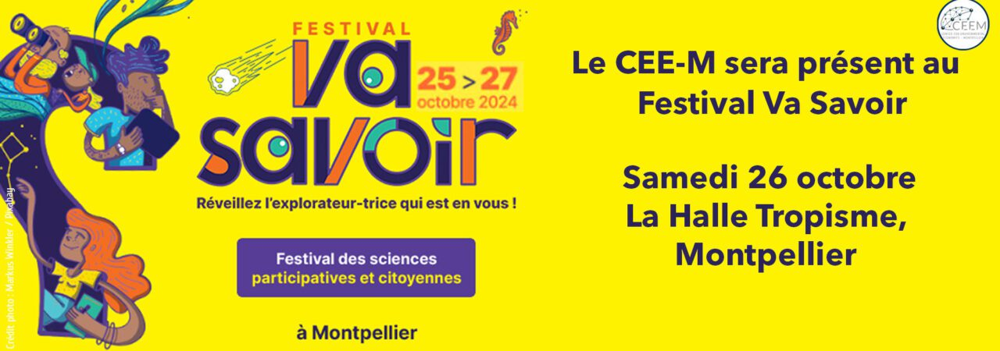{height="60"}

*Fête de la Science* (October 2024, Montpellier).  
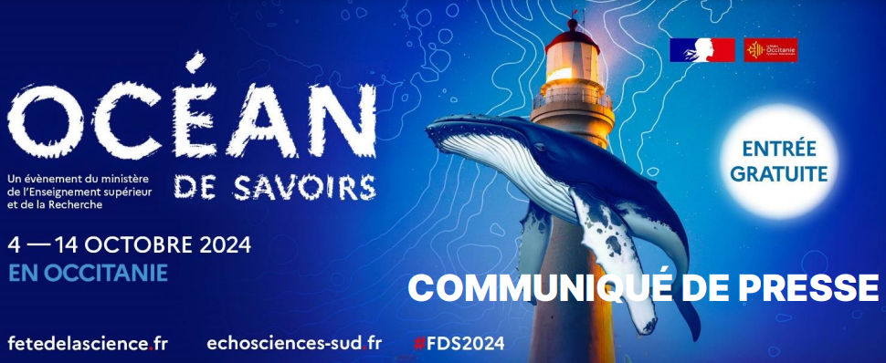{height="60"}
:::

---

## From public events to a lab-in-the-field experiment

We decided to turn these events into a lab-in-the-field experiment, by collecting experimental data from the general public.

- Behavioral and experimental economics often rely on student samples.
- These events offer a unique opportunity to reach a more diverse population (age, profession, family structure).

::: {.callout-tip appearance="simple"}
- The 2024 Fête de la Science in Montpellier was organized under the theme **“Océan de savoir”** (*Ocean of Knowledge*).
- This theme inspired us to design an experiment about **resource sharing and sustainability**.  
- During these events, visitors come to the stand *one group after another* — families, friends, children, grandparents — which naturally mirrors **a sequence of generations** exploiting a shared resource.  

⇒ **We decided to focus on intergenerational shared resources**.
:::

<!-- NEW SECTION -->

# The Common-Pool Resource Problem

---

## The tragedy of the commons

A common-pool resource (CPR) is a resource that is:

  - **rivalrous** (one’s use reduces what remains)  
  - **non-excludable** (others can access it).

Examples: fisheries, groundwater, forests …

 

::: {.callout-note appearance="minimal"}
*Individually rational extraction leads to collective collapse.*   
⇒ known as **the tragedy of the commons** (Hardin, 1968).  
:::

---

## The CPR Game 

*Walker, Herr, Gardner & Ostrom (2000)*

- $n$ players share a common resource.
- Each player $i$ chooses an extraction level $x_i$.
- Total extraction: $X = \sum_{i=1}^n x_i$
- Individual Payoff: $\pi_i(x_i, X) = a x_i - b x_i^2 - x_i(c + k X)$

Where:

- $B_i(x_i) = a x_i - b x_i^2$ : Individual benefit function (increasing, concave)
- $C_i(x_i, X) = x_i (c + kX)$ : Individual cost function (increasing, convex, with negative externality from total extraction)

---

## Equilibrium and Social Optimum

**Nash equilibrium**

Each player maximizes their own payoff given the others’ decisions: $\max_{x_i} \ \pi_i(x_i, X_{-i}) = a x_i - b x_i^2 - x_i (c + k(x_i + X_{-i}))$  
Assuming symmetry $x_i = x$, $X = nx$  
$\implies x_i^{N} = \frac{a - c}{2b + k(n+1)}$

**Social optimum**

Maximize total group payoff $\Pi = \sum_{i=1}^n \pi_i$  
$\max_{x_1, \dots, x_n} \ \sum_{i=1}^{n} \left(a x_i - b x_i^2 - x_i (c + kX)\right)$  
$\implies x_i^{SO} = \frac{a - c}{2b + 2kn}$

---

## Illustration of the CPR game

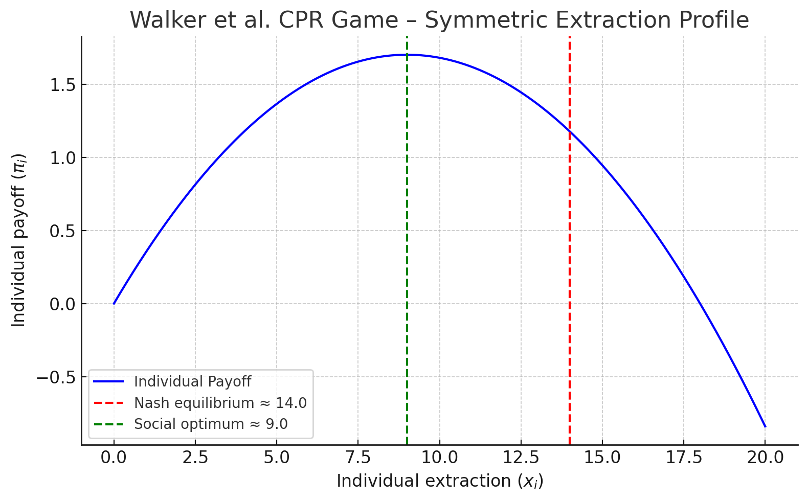{fig-align="center" height="500"}

::: {style="text-align: center; font-size: 0.75em;"}
*Parameters : a=0.761, b=0.007, c=k=0.005, n=7*
:::

---

## E. Ostrom: Beyond the Tragedy — Institutions and Collective Action

- Showed that collapse is not inevitable.
- Field and lab evidence that many communities often create institutions, norms, and rules to manage CPRs sustainably (Ostrom 1990, Ostrom, Walker & Gardner 1992, Walker et al. 2000).

*Key mechanisms:*

  - Communication and shared norms  
  - Monitoring and graduated sanctions  
  - Collective choice (voting, self-governance)

<!-- NEW SECTION -->

# From Intragenerational to Intergenerational CPRs

---

## Intergenerational CPRs

- Almost all naturally occurring CPRs are **intergenerational**: climate change, biodiversity loss, and resource depletion depend on today’s choices.
- Mechanisms that have been shown to mitigate the overexploitation problem are not easily available across distant generations of users: future generations have **no agency** — they cannot reciprocate, vote, or punish. 

⇒ **Cooperating with the future** is a special kind of social dilemma.  

 

::: {.callout-tip appearance="minimal"}
In most CPR studies and experiments, players belong to the same generation and interact simultaneously.  
*What happens when **different generations** exploit the same resource over time?*
:::

---

## Intergenerational CPR - Related literature

::: {style="font-size: 0.9em;"}
- **Fischer, Irlenbusch & Sadrieh (2004, JEEM)**
Intergenerational link raises expectations but not actual cooperation. 
- **Jacquet et al. (2013, Nature Climate Change)**
Intergenerational discounting severely undermines cooperation —short-term gains dominate long-term welfare.
- **Hauser et al. (2014, Nature)**
Democracy (median voting) sustains cooperation across generations.
- **Shahrier et al. (2017, Nature Sustainability), Timilsina et al. (2017, PlosOne)**
Urban (more capitalist) communities show lower intergenerational concern than rural ones.
- **Chang et al. (2021, Royal Soc. Open Sci.)**
Material interest in future use of the resource promotes sustainability, but when many others share the resource (high density cues) trust in future benefit drops and extraction rises.
:::

---

## The Intergenerational Goods Game (IGG)

*Hauser, Rand, Peysakhovich, Nowak (2014, Nature)*

- Successive generations of 5 players share a common pool of 100 units.
- Each player can extract 0–20 units.
- If total extraction ≤ threshold T = 50%, the pool renews to 100 units.  
- If extraction > T, the resource collapses → all future generations get 0.
- The game continues with probability $δ = 0.8$ (≈ 5 generations expected).

**Social optimum:** 10 units per player  
**Individual temptation:** 20 units per player

---

## Illustration of the IGG

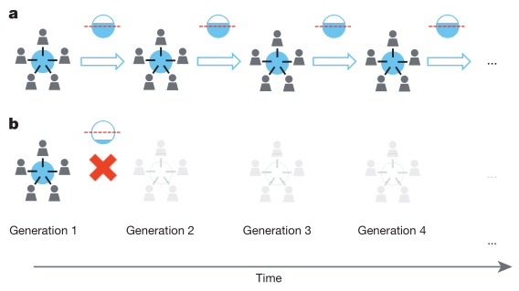{fig-align="center" height="400"}

a) The resource is renewed in each generation.
b) The resource collapses after generation 1.

---

## Research Question

***Does intragenerational conflict undermine cooperation with the future?***

We disentangle:

- Intergenerational dilemma: present vs. future.  
- Intragenerational dilemma: conflict among current individuals.

<!-- NEW SECTION -->

# Adapted IGG and Experimental Design

---

## Adapted IGG

- Two treatments:
  - **1P** (👤): one player extracts 0–60 units  
  *intergenerational dilemma only*.
  - **3P** (👤👤👤): three players extract 0–20 units each  
  *inter + intragenerational dilemmas*.
- Renewal threshold T = 30 units (≤ 50 % of the resource).
- If extraction > T → resource collapses → all future payoffs = 0.
- No probabilistic continuation (5 generations fixed).

---

## Adapted IGG - Illustration

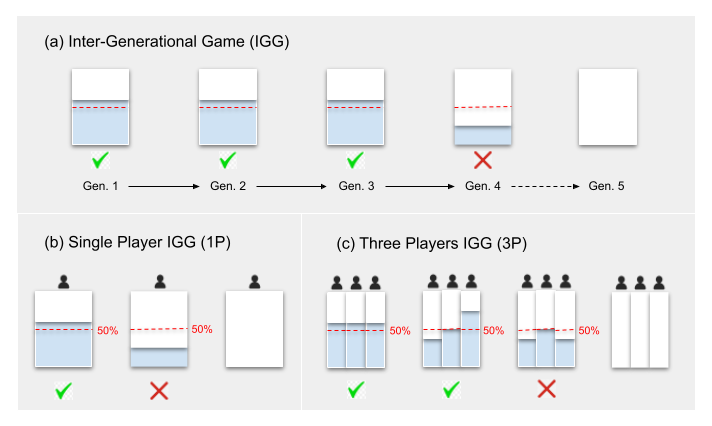{fig-align="center" height="500"}

---

## Hypotheses

1. Cooperation is higher when no intragenerational conflict exists (1P > 3P).  
2. Intragenerational conflict reduces sustainability via coordination failures.

---

## Data collection

- During the 2024 *Nuits des chercheurs* and the 2024 *Fête de la Science*
- Participants included students and members of the general public.
- Experiment implemented on tablets.
- Strategy method : participants took decisions for generation 1, generations 2–4, and generation 5 (no future value).

 

::: {.callout-note appearance="minimal"}

- Generations were constructed ex post, after individual decisions were collected.
- Participants were paid according to their extraction decisions, by bank transfer (€ 0.15/unit in 1P and € 0.45/unit in 3P).

:::

---

## Participants

|                     | 1P              | 3P              |
|---------------------|-----------------|-----------------|
| Participants        | 137             | 123             |
| Age (mean)          | 30.40           | 32.05           |
| Gender (male)       | 37.96%          | 39.84%          |
| Single              | 57.66%          | 56.10%          |
| With children       | 48.18%          | 49.59%          |
| Students            | 47.45%          | 38.21%          |
| Executives          | 29.20%          | 30.89%          |

<!-- NEW SECTION -->

# Results

---

## Cooperation and Extraction

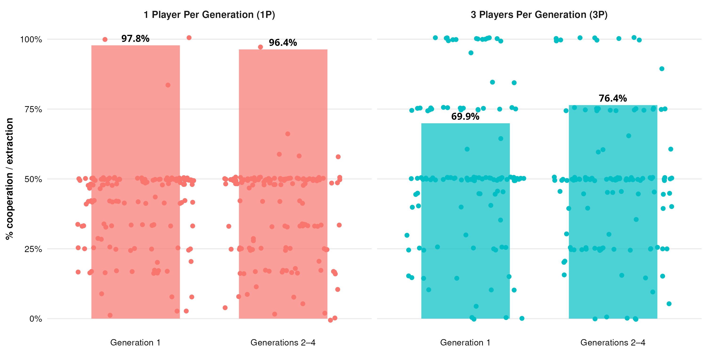{fig-align="center" height="450"}

With contemporaries, cooperation collapses (*fisher's exact test p<0.001*).

---

## Extraction Distributions

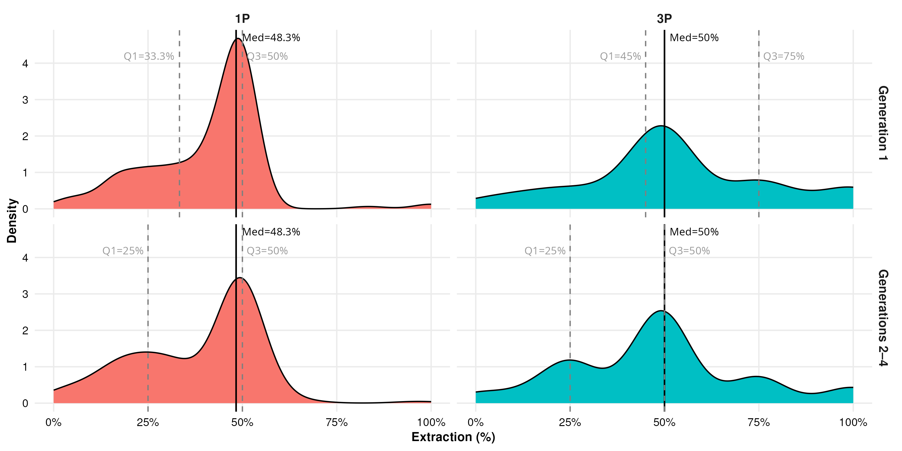{fig-align="center" height="450"}

Distributions are significantly different between the two treatments  
*ks-test, p < 0.001*

---

## Regression Analysis

|                            | Cooperation | Extraction (%) |
|----------------------------|-------------|----------------|
| 1P × Gen 1 (réf.)          | 13.015***   | 0.364***       |
| 3P vs 1P                   | -4.572*     | 0.123***       |
| Gen 2–4 vs Gen 1           | -1.835      | -0.027         |
| Interaction (3P × Gen 2–4) | 4.674*      | -0.027         |
|                            |             |                |
| Num.Obs.                   | 520         | 520            |

::: {style="font-size: 0.8em;text-align: center;"}
$^{*}$ p < 0.05, $^{**}$ p < 0.01, $^{***}$ p < 0.001  
Control variables: gender, age, num. of children.  
:::

 

::: {style="text-align: center;"}
Cooperation: Generalized Linear Mixed Model (GLMM)  
Extraction: Linear Mixed Model (LMM).
:::

---

## Resource sustainability

*Monte Carlo (10 000 trajectories)* to estimate the **expected survival of the resource** over five generations.

::: {.columns}
::: {.column style="font-size: 0.7em;"}

1. Draw participants from the experiment (4 in 1P, 12 in 3P, w/o replacement).
2. Form 4 generations (1 or 3 players per generation).
3. Apply the renewal rule.
4. Store the generation at which the resource collapses (if any), otherwise store 5 (full survival).
5. Repeat the process 10,000 times to simulate variability in group composition and decisions.
6. Compute, for each generation, the fraction of trajectories in which the resource is depleted, and the expected survival duration of the resource.

:::
::: {.column}

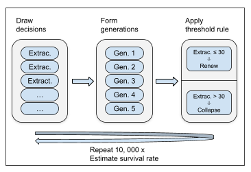{fig-align="center" width="90%"}

:::
:::

---

## Resource Sustainability - Simulation Results

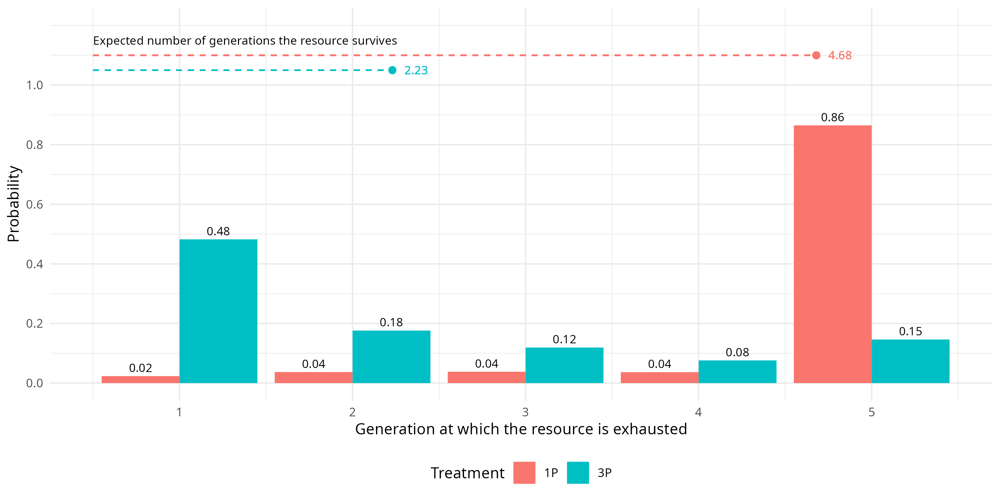{fig-align="center" height="450"}

::: {style="text-align: center;"}
Intragenerational conflict drastically reduces resource sustainability.
:::

<!-- NEW SECTION -->

# Ex-post theoretical models

---

## Two models of intergenerational cooperation

- The first model assumes *fully rational agents* with perfect foresight and common knowledge — they know the game and reason infinitely forward.

- The second model assumes *boundedly rational agents* — they maximize utility, but their beliefs are simplified and shaped by heuristics rather than full strategic reasoning.

---

## Rational Intergenerational Goods Game

- Let $u_g=x_g$ : utility of generation $g$ equals its extraction.  
- Let $V_g$ the total utility of generation $g$: 
$$V_g = u_g + \beta V_{g+1}$$

  

$\beta$ captures the intergenerational altruism.

::: {.callout-note appearance="minimal"}
- $\beta \in [0,1)$: future generations weighted less than the present (present = 1).
- $\beta$ constant across generations — current altruism projected forward.
:::

---

### Solving the model

$$
\begin{align*}
V_1 &= u_1 + \beta V_2 = u_1 + \beta (u_2 + \beta V_3) \\
    &= u_1 + \beta u_2 + \beta^2 (u_3 + \beta V_4) = \cdots = u_1 + \beta u_2 + \beta^2 u_3 + \cdots \\
    &= u \cdot \frac{1}{1 - \beta} \quad \text{if } u_g = u, \forall g \text{ and } n \to \infty
\end{align*}
$$

 

::: {.callout-tip appearance="minimal"}
- **Defection** yields an immediate $u_1=60$ and resource collapse, so $V_1=60$.
- **Cooperation** sustains $u_g=30$ forever.  
⇒ Cooperation if $V_1(\text{coop}) > V_1(\text{defect}) \implies 30 \times \frac{1}{1 - \beta} > 60 \implies \beta > 0.5$.
:::

---

### The model's predictions - 1P

**1P (n=1)**  

- If $\beta > 0.5$, the extraction path is sustainable. 
- If $\beta \leq 0.5$, the extraction path is non-sustainable.

---

### The model's predictions - 3P

**3P (n=3)**

Introduce $\hat{x}_{g}^{-i}$ which is player $i$'s belief about the total extraction  of the two other players in his generation.

$\implies V^i_g=u^i_g(x^i_g, \hat{x}_{g}^{-i}) + \beta V_{g+1}$

::: {style="font-size: 0.9em;"}
3 possible cases:

1. The two other players have $\beta \leq 0.5$.
2. The two other players have $\beta > 0.5$.
3. One player has $\beta \leq 0.5$ and the other $\beta > 0.5$.
:::

---

### Myopic players

::: {style="font-size: 0.95em;"}

They assume that the composition of their current generation will not change in future generations.

- if $\beta_i \leq 0.5$, player $i$ extracts 20 units, whatever their beliefs about others.
- if $\beta_i > 0.5$, player $i$'s extraction depends on their beliefs about others' altruism.
  - Case 1 (others' $\beta \leq 0.5$): $\hat x^{-i}_g=40$ ⇒ $x^i_g=20$.
  - Case 2 (others' $\beta > 0.5$): $\hat x^{-i}_g=20$ ⇒ $x^i_g=10$.
  - Case 3 (mixed): the player with $\beta \leq 0.5$ extracts 20, leading $i$ to believe $\hat x^{-i}_g \geq 20$ ⇒ both players with $\beta > 0.5$ have to coordinate to reach $x_{g}^{i} + x_{g}^{k} = 10$, but coordination failure may occur ($x_{g}^{i} + x_{g}^{k} > 10$).

:::

---

### Farsighted players

::: {style="font-size: 0.95em;"}

They anticipate that the composition of their current generation may change in future generations.  
Let $p$ be the probability that the next generation will not deplete the resource.

$$
V_{1}^{i} = u_{1}^{i}(x_{1}^{i}, x_{1}^{-i}) + \beta E[V_{2}] \,\, \text{where} \,\, E[V_{2}] = p V_{2}^{\text{sust}} + (1 - p) \times 0 = p V_{2}^{\text{sust}}
$$

$$
\begin{align*}
V_{1} &= u_{1} + \beta p \left[ u_{2} + \beta E[V_{3}] \right] \\
         &= u_{1} + \beta p \left[ u_{2} + \beta p \left[ u_{3} + \beta E[V_{4}] \right] \right] \\
         &= u_{1} + \beta p u_{2} + \beta^2 p^2 u_{3} + \cdots \\
         &= u \times \left( \frac{1}{1 - \beta p} \right) \quad \text{if } u_g = u, \forall g \text{ and } n \to \infty
\end{align*}
$$

:::

---

### Farsighted players (cont.)

::: {.callout-tip appearance="minimal"}
Defection yields an immediate payoff of 60 and resource collapse, so $V_1(\text{defect})=60$.  
Cooperation sustains $u_g=30$ forever, so $V_1(\text{coop})=30 \times \frac{1}{1 - \beta p}$.  
⇒ Cooperation if $V_1(\text{coop}) > V_1(\text{defect})$ $\implies \frac{30}{1 - \beta p} > 60$ $\implies \beta p > 0.5$
:::

::: {style="font-size: 0.75em;"}
As the probability of sustainability decreases, the altruistic component must increase to compensate.
:::

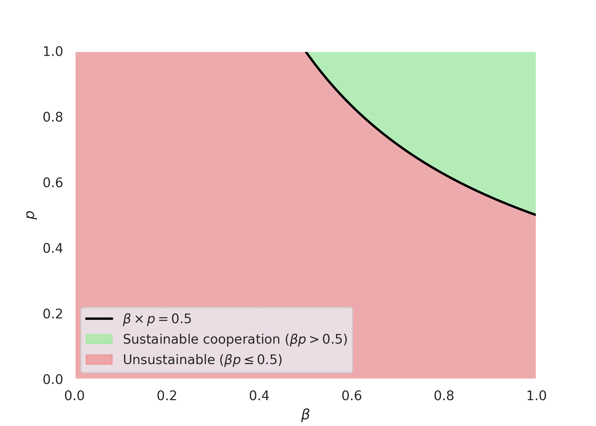{fig-align="center" height="400"}

---

### Rational model — Key insights

- In the one-player case, sustainability requires that intergenerational altruism exceeds a critical threshold — cooperation arises only if $\beta > 0.5$.

- In the three-player case, the same logic applies, but each player must also believe that the next generation will cooperate. The condition becomes $\beta p > 0.5$, where $p$ represents the perceived probability that future generations will sustain the resource.
⇒ **Even highly altruistic players will defect if they expect others not to cooperate** — beliefs about the future are as important as altruistic preferences.

---

## From rationality to bounded rationality

- The rational model provides a clear normative benchmark but it assumes perfect reasoning, common knowledge and accurate beliefs.

- In reality, people’s expectations about others and the future are uncertain, biased, and shaped by simple heuristics rather than full strategic reasoning.

 

::: {.callout-tip appearance="simple"}
The rational model tells us when cooperation should occur, but to understand when it actually occurs, we must model how individuals form beliefs and process uncertainty — that’s the goal of our bounded-rationality model.
:::

---

## Boundedly Rational Intergenerational Goods Game

::: {style="font-size: 0.8em;"}
$$
u_{i,g} =
\begin{cases}
x_{i,g} + \beta_{i,g} \cdot p_{i,g} \cdot V_{g+1}, & \text{if } X_g \leq 30 \\
x_{i,g}, & \text{if } X_g > 30
\end{cases}
$$

 

- $\beta_i \in [0,1]$ is the player's future oriented preference (intergenerational altruism / discount factor).

- $p_{i} \in [0,1]$ is the player's subjective belief that others will cooperate and the resource will survive.

- $V_{g+1} = 30 + \beta_{i,g} \cdot p_{i,g} \cdot V_{g+2}$ $\implies V_{g+1} = \frac{30}{1 - \beta_{i,g} p_{i,g}}$  
assuming $X_{g+m} = 30$ $\forall m \geq 1$ and infinite horizon.

$$\implies u_{i,g} = x_{i,g} + \beta_{i,g} \cdot p_{i,g} \cdot \frac{30}{1 - \beta_{i,g} p_{i,g}}$$

:::
---

## Predictions of the bounded-rationality model

### 1P (n=1)

- $p_{i, g}=1$, beliefs about others' cooperation are irrelevant.

$$
u_{i,g} =
\begin{cases}
30 + \beta_{i,g} \cdot \frac{30}{1 - \beta_{i,g}} = 30 \cdot \frac{1}{1 - \beta_{i,g}} & \text{if cooperation}  \\
60 & \text{if defection} 
\end{cases}
$$

⇒ cooperation if $\beta_{i,g} \geq 0.5$.

 

::: {.callout-tip appearance="minimal"}
In the absence of intragenerational competition, cooperation depends only on the player's personal valuation of future welfare.
:::

---

### 3P (n=3)

::: {style="font-size: 0.8em;"}
- Players must form beliefs about others’ behaviors.
- Cooperation is contingent on altruism and expectations.

Let the belief parameter $p_{i,g}$ be a function of the perceived distance from the sustainability threshold $z=30-\mathbb{E}[X_{-i, g}]$

where $\mathbb{E}[X_{-i, g}] \in \{0, 40\}$ is player $i$'s expectation of the total extraction by the other two players in generation $g$. 

$z$ is referred to as the ***perceived sustainability***. 

  

::: {.callout-note}
A higher $z$ means player $i$ believes others will extract less. If player $i$ has altruistic concerns for the future, $z$ represents the maximum amount they believe they can extract without depleting the resource.
:::
:::

---

#### Belief function $\phi(z, \alpha)$

::: {style="font-size: 0.8em;"}
Let $p_{i,g} = \phi(z, \alpha)$ such that:
$$\phi(z, \alpha) =
\begin{cases}
1, & \text{if } z \geq 30 \\
f(z, \alpha), & \text{if } 0 < z < 30, \text { with } \alpha > 0 \\
0, & \text{if } z < 0
\end{cases}
$$

⇒ $p_{i,g}$ is a bounded, increasing function that maps perceived sustainability to the subjective probability that the resource survives to generation $g+1$.

 

::: {.callout-note appearance="minimal"}
- $f(z, \alpha)$ is an increasing function that captures how beliefs adjust within the uncertainty range. 
- $\alpha$ governs the willingness to make a sacrifice based on perceived deviations from the sustainability threshold.
- The form of $\phi(z,\alpha)$ over $z \in [0, 10)$ critically shapes player $i$'s behavior: they believe $X_{-i, g}>20$ but see an opportunity to prevent depletion through personal sacrifice.
:::
:::

---

#### Illustration of belief functions

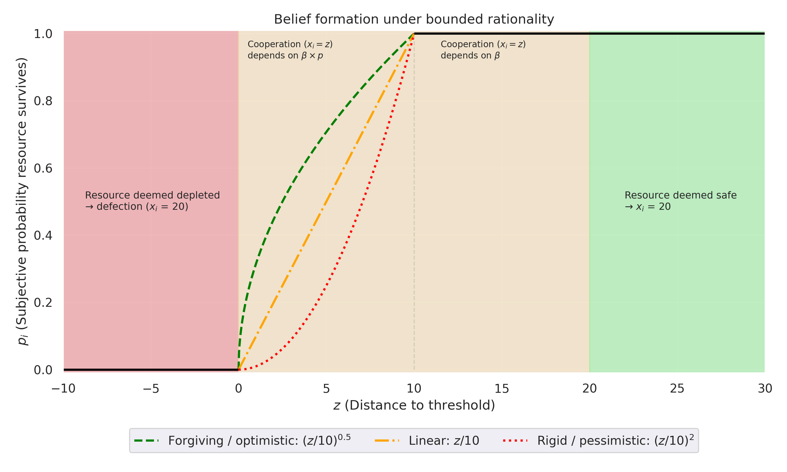{fig-align="center" height="600"}

---

#### Cooperation condition in 3P

For $z \in [0, 10)$: 
$$
U_{i,g} = 
\begin{cases}
z + \beta_{i,g} \cdot p_{i, g} \cdot \frac{30}{1 - \beta_{i,g} \cdot p_{i, g}} & \text{if cooperation} \\
20 & \text{if defection}
\end{cases}
$$

 

⇒ cooperation with $x_{i, g}=z \text { \, if \,} \beta_{i, g} \cdot p_{i, g} \geq \frac{20-z}{50-z}$

 

::: {.callout-tip appearance="minimal"}
The smaller $z$ (greater required sacrifice) the higher player $i$'s altruism, belief, or both (i.e., $\beta_{i,g} \cdot p_{i,g}$) must be to justify cooperation.
:::

---

#### Extraction decisions in 3P

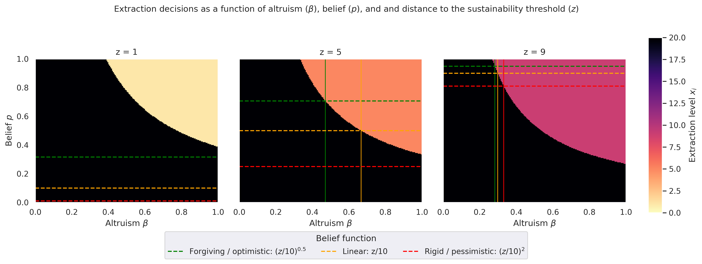{height="500"}

---

### Bounded-rationality model — Key insights

::: {style="font-size: 0.9em;"}

- Extends the rational benchmark by replacing objective probabilities with **subjective beliefs** about others’ cooperation.

- Players combine intergenerational altruism ($\beta$) and beliefs ($p$) into an effective altruism term.

- Beliefs follow heuristic functions $\phi(z, \alpha)$ capturing **optimistic, neutral, or pessimistic** expectations.

- Stronger altruism ($\beta$) or optimism ($p$) promotes sustainability: **forgiving types cooperate** under uncertainty; **rigid types defect** unless success is almost certain.

::: {.callout-tip appearance="minimal"}
Cooperation may fail not because players are selfish, but because **their beliefs and heuristics distort** how they perceive the future.
:::
:::

<!-- NEW SECTION -->

# Findings and implications

- **Intragenerational social dilemmas significantly reduce cooperation** with the future and resource sustainability.

- **Effective sustainability policies** must address both *Intergenerational dilemmas* (future concern, altruism) and *Intragenerational dilemmas* (trust, coordination, social norms).

- Policy Implications 
  - **Structural tools**: institutions, monitoring, and group decision mechanisms to mitigate free-riding among current users.
  - **Normative tools**: education, nudges, and future-oriented framing to promote concern for long-term outcomes.

---

**Next steps — Back to the lab**

- Replicate the field experiment under controlled laboratory conditions to confirm causal mechanisms and rule out contextual confounds.

- Elicit beliefs about future generations’ cooperation to test the theoretical predictions of the rational and bounded-rational models.

- Disentangle the drivers behind extreme future-oriented behaviors: altruism, optimism, coordination motives, or social identity effects?
